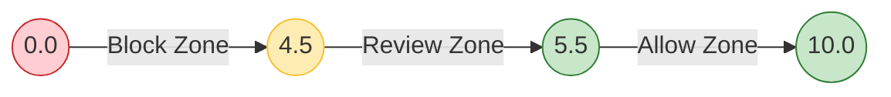

# Spezzatura: The T² Reputation Engine
> **"Confidence is a calculated vector, not a feeling."**

The **Spezzatura Engine** is the deterministic core of F2F-RAaT. It transforms raw behavior into a computable score.

Unlike traditional credit scoring or fraud models that use opaque machine learning, Spezzatura uses **transparent, vector-based algebra**. Every point in the score can be traced back to a specific, auditable event.

---

## 📐 The T² Equation

Reputation is modeled as a product of six orthogonal vectors, logarithmic in scale.

$$
\text{Score} = \log_2(C \times A \times T^2 \times U \times R \times \hat{A})
$$

### The Six Vectors

| Vector | Name | Definition | Why it matters? |
| :--- | :--- | :--- | :--- |
| **C** | **Contextual Compliance** | Adherence to policy rules. | Are they following the rules? |
| **A** | **Operational Activity** | Volume and velocity of actions. | Are they actually using the system? |
| **T** | **Time & Regularity** | Consistency over time (Squared weight). | **Trust takes time.** Why $T^2$? Because consistency is harder to fake than intensity. |
| **U** | **Uniqueness** | Entropy of behavior. | Are they a bot or a human? |
| **R** | **Relationships** | Quality of peers in the cluster. | Who do they transact with? |
| **Â** | **Animus** | Operational intent (Vector direction). | Are they trying to attack or transact? |

---

## 📊 Score Bands & Interpretation

The output is a scalar float, typically between **0.0** and **10.0**, mapped to decision bands.

## 📚 Component Specifications

- **[T² Formal Spec](spezzatura_t2_spec.md)**: The complete mathematical definition.
- **[Vector Calculation](vector_calculation.md)**: Formal definitions and **numerical examples** for computing $C, A, T...$ from raw facts.
- **[Sigmoid P(x) Model](sigmoid_px_model.md)**: The acute reactivity model for immediate threats.
- **[Examples](examples/)**: Walkthroughs of score calculation.

---

[⬅️ Back to Main Spec](../README.md)
