# F2F-RAaT: From Fact to Feedback
### Trust by Physics. A Deterministic Execution Engine for Regulated Environments.

[](https://github.com/foundlab/f2f-raat-spec)
[](ATI_ARCHITECTURE/)
[](LICENSE)
[](STATE_CAPSULE/)
[](COMPLIANCE_KIT/COMPLIANCE_MATRIX.md)

---

> **"Reputation should not be an opinion. It should be a transaction."**

**F2F-RAaT** is a **non-oracular, deterministic execution engine** designed It transforms objective, factual events into executable, economically-binding decisions without statistical inference, predictive models, or data exposure. It provides a cryptographically verifiable and fully auditable framework for turning reputation into a transactional mechanism.

👉 **[Start here: Master Index & Guide](INDEX.md)**

This repository contains the **official specification**, **execution contract**, **invariants**, **audit structures**, and **cryptographic commitments** that define the F2F-RAaT Framework.

---

## ⚡ The Core Proposition

| Feature | The Old Way (Predictive AI) | The F2F-RAaT Way (Trust Physics) |
| :--- | :--- | :--- |
| **Logic** | Probabilistic ("Maybe Fraud") | **Deterministic** ("Policy Violation Defined at Line 42") |
| **Data** | Leaky (Requires PII/Docs) | **Capsulated** (PII-Free State Objects) |
| **Audit** | "Explainable" (Post-Hoc Rationalization) | **Verifiable** (Cryptographic Proof of Causality) |
| **Action** | Passive Scoring | **Binding Execution** |

---

## 🏗️ Architecture & Flow

F2F-RAaT operates as a closed-loop reputational state machine. Every input is a formal fact; every output is a signed decision + audit trail.

```mermaid
flowchart TD
    subgraph INPUT ["1. The Objective World"]
        F[FACT]:::fact
        style F fill:#e1f5fe,stroke:#01579b
    end

    subgraph ENGINE ["2. The Black Box (PII-Free)"]
        direction TB
        S[Spezzatura T² Engine]:::engine
        SC[(STATE CAPSULE)]:::capsule
        BE[Burn Engine]:::fire
        
        S -->|Updates| SC
        SC -->|Feeds| BE
    end

    subgraph OUTPUT ["3. The Binding Reality"]
        D[DECISION]:::decision
        VP[Veritas Proof]:::proof
    end

    F -->|Ingest| S
    F -->|Trigger| BE
    BE -->|Executes| D
    BE -->|Commits| VP
    VP -.->|Feedback Loop| S

    classDef fact fill:#e3f2fd,stroke:#1565c0,stroke-width:2px;
    classDef engine fill:#f3e5f5,stroke:#7b1fa2,stroke-width:2px;
    classDef capsule fill:#fff3e0,stroke:#e65100,stroke-width:2px,stroke-dasharray: 5 5;
    classDef fire fill:#fbe9e7,stroke:#bf360c,stroke-width:2px;
    classDef decision fill:#e8f5e9,stroke:#2e7d32,stroke-width:2px;
    classDef proof fill:#eceff1,stroke:#455a64,stroke-width:2px;
```



---

## 🧬 Anatomy of an Execution

How F2F-RAaT turns a fact into a binding decision in 3 milliseconds.

### 1. The Input (Formal Fact)
*An objective event occurs. No PII, just behavior.*

```json
{
  "fact_id": "evt_9982371",
  "type": "geo_velocity_violation",
  "dimensions": { "distance_km": 4000, "delta_t_sec": 300 }
}
```

### 2. The State (State Capsule)
*The engine loads the user's reputational physics. No names, only vectors.*

```json
{
  "T²": { 
    "score": 4.2, 
    "vectors": { "Compliance": 0.3, "Consistency": 0.9 } 
  },
  "Flags": ["PREVIOUS_VELOCITY_WARN"],
  "Proof": "0x7f8a9d..." 
}
```

### 3. The Output (Binding Decision)
*The `Burn Engine` applies the Policy to the Capsule.*

```json
{
  "decision": "BLOCK_AND_FREEZE",
  "reason": "POLICY_VELOCITY_IMPOSSIBLE_TRAVEL",
  "veritas_proof": "0xdef1ca7e...",
  "expiration": "24h"
}
```

---

## 📚 Component Reference

The specification is modular. Each directory contains normative rules for that subsystem.

### 🧠 Core Logic
- **[SPEZZATURA/](SPEZZATURA/)** — **The Brain**. The T² reputation model specification.
- **[STATE_CAPSULE/](STATE_CAPSULE/)** — **The Memory**. The PII-free, cryptographically-verifiable boundary object.
- **[F2F-RAAT/](F2F-RAAT/)** — **The Law**. The Execution Contract and official Invariants.
- **[BURN_ENGINE/](BURN_ENGINE/)** — **The Hammer**. The deterministic authorization engine.

### 🛡️ Assurance & Governance
- **[VERITAS/](VERITAS/)** — **The Truth**. Specification for immutable audit trails and proofs.
- **[THREAT_MODEL/](THREAT_MODEL/)** — **The Defenses**. Analysis of adversarial vectors (e.g., Poisoning).
- **[COMPLIANCE_KIT/](COMPLIANCE_KIT/)** — **The Standards**. Test vectors, Q.A., and Regulatory mapping (GDPR/LGPD).
- **[GOVERNANCE/](GOVERNANCE/)** — **The Control**. Rules for policy signing and break-glass protocols.
- **[WHITEPAPER/](WHITEPAPER/)** — **The Theory**. The deep-dive conceptual framework.

---

## 📦 Versioning & Integrity

Current Spec Version: **1.1.0**

- **Semantic Versioning**: `MAJOR.MINOR.PATCH`
- **Integrity**: All normative docs are hashed. Changing a line in `invariants.md` invalidates the spec signature.

## 🔐 License

Founded by **FoundLab**.  
Licensed under **Creative Commons Attribution-NonCommercial-NoDerivatives 4.0 International**.
See [LICENSE](LICENSE) for details.
