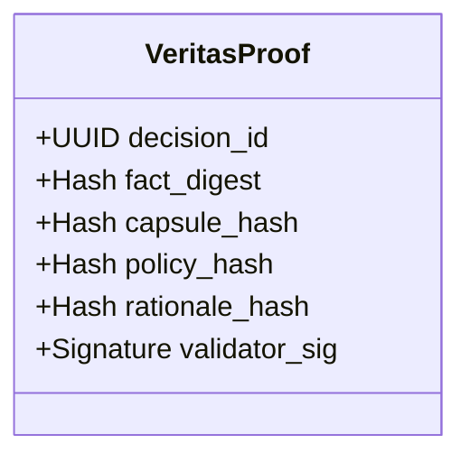

# Veritas: The Protocol of Truth
> **"Do not trust. Verify."**

**Veritas** is the cryptographic audit layer of F2F-RAaT. It ensures that every decision made by the engine is immutable, re-executable, and mathematically provable.

In a regulated environment, it is not enough to make the right decision. You must be able to **prove** why you made it, five years later, in court.

---

## 🔗 The Proof Chain

Every execution generates a `VeritasProof` bundle:

### The Unforgeable Audit Trail

1.  **Fact Digest**: Hashes the input event (without storing PII).
2.  **Capsule Hash**: Freezes the reputational state used at that exact millisecond.
3.  **Policy Hash**: Complies with "Code is Law". Proves strictly *which* policy version was active.
4.  **Rationale Hash**: A sealed explanation of *why* the decision was taken (e.g., "Velocity > 500").

---

## 🏛️ Cognitive Auditability

Veritas enables **Cognitive Auditability**:
> *The ability to reconstruct the exact "brain state" of the AI at the moment of decision.*

If a regulator asks "Why did you block this user in 2024?", you do not look at logs. You reload the `VeritasProof` and re-run the transaction. The result will be identical.

## 📚 Specifications

- **[Proof Format Spec](veritas_proof_spec.md)**: The JSON structure of the proof.
- **[Audit Rules](audit_rules.md)**: How to validate a proof chain.
- **[Compliance Mapping](../COMPLIANCE_KIT/COMPLIANCE_MATRIX.md)**: How Veritas satisfies BACEN/SOX retention rules.

---

[⬅️ Back to Main Spec](../README.md)
