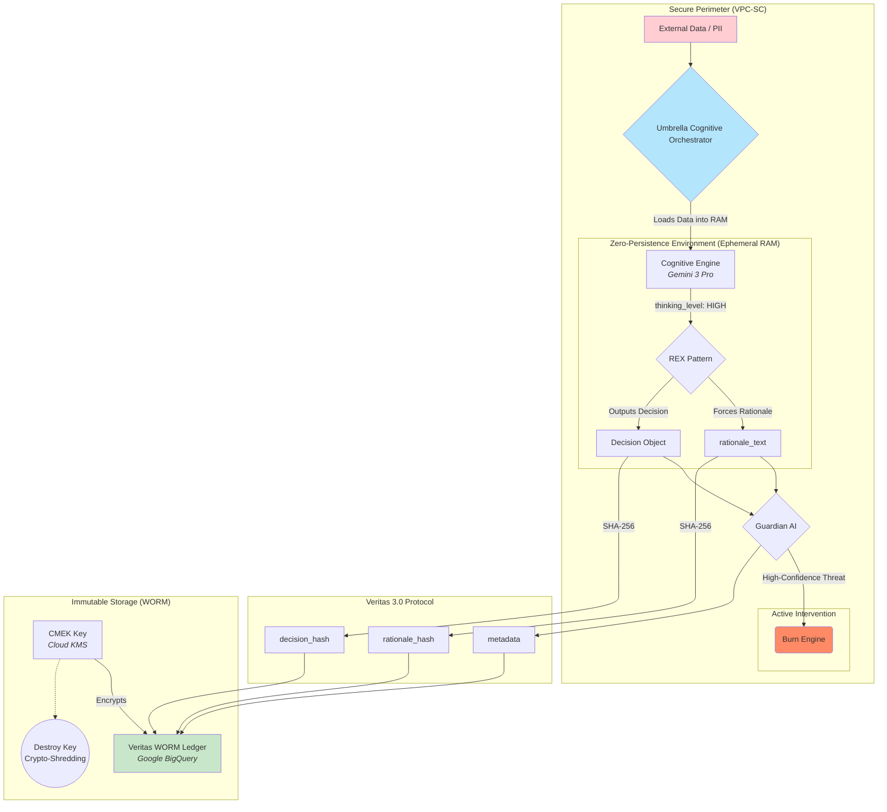

```mermaid
graph TD
    subgraph "Secure Perimeter (VPC-SC)"
        direction LR
        A[External Data / PII] --> B{Umbrella Cognitive Orchestrator};

        subgraph "Zero-Persistence Environment (Ephemeral RAM)"
            direction TB
            C[Cognitive Engine<br/><i>Gemini 3 Pro</i>] -->|thinking_level: HIGH| D{REX Pattern};
            D -->|Forces Rationale| E[rationale_text];
            D -->|Outputs Decision| F[Decision Object];
        end

        B -->|Loads Data into RAM| C;
        E --> G{Guardian AI};
        F --> G;

        subgraph "Active Intervention"
            direction TB
            H(Burn Engine)
        end

        G -->|High-Confidence Threat| H;
    end

    subgraph "Veritas 3.0 Protocol"
        direction TB
        I[rationale_hash]
        J[decision_hash]
        K[metadata]
    end

    E -->|SHA-256| I;
    F -->|SHA-256| J;

    subgraph "Immutable Storage (WORM)"
        direction TB
        L[Veritas WORM Ledger<br/><i>Google BigQuery</i>];
        M[CMEK Key<br/><i>Cloud KMS</i>] -->|Encrypts| L;
        N((Destroy Key<br/>Crypto-Shredding));
        M -.-> N;
    end

    I --> L;
    J --> L;
    G --> K;
    K --> L;

    style A fill:#ffcdd2
    style L fill:#c8e6c9
    style H fill:#ff8a65
    style B fill:#b3e5fc
```
